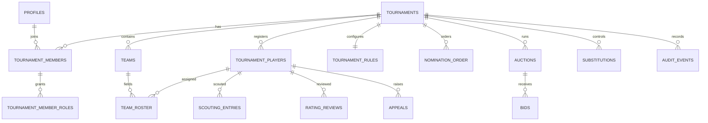

# PurpleBeanGaming database schema

Integer columns represent MMR and credits. Historical roster rows snapshot tournament MMR. Partial uniqueness prevents a player from occupying two active teams. Bid request IDs are globally unique.

The public API is limited to `public_tournament_summary`, `public_player_pool`, `public_teams`, and `public_auction_state`. Internal tables remain subject to RLS.
